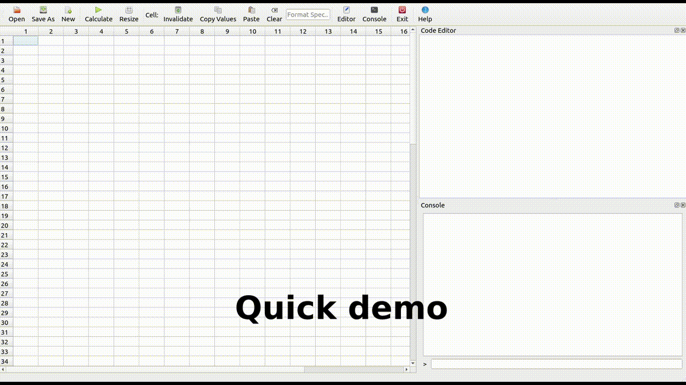

# simple spreadsheet

This simple spreadsheet demonstrates calcengine. It is based on Qt and
took longer to write than the calcengine. It could potentially be adjusted 
to use a different calculation engine backend.

It has similarities to other spreadsheets in that it supports cell formulae
although these are python based. It also has a simple code editor which effects the
global scope for all cells.

Cell formula use R1C1 notation (or a subset of it including relative references)
and are compiled into real python functions. These functions are wrapped with
calcengine decorators to provide a simple dependency chain.

On calculation cell formula are converted into real python objects. This means
a whole pandas dataframe or matplotloib image can be stored in a cell.

Some keyboard shortcuts similar to Excel are included including a form of
fill down (Control + D) and fill right (Control + R).

Files can be saved as JSON and calculated values are serialized if possible.

## Demo

## Features

* Open / save as JSON format.
    * Formulas and formats stored.
    * Values are stored if serializable, otherwise recalculated on open.
    * Specialized serializers for pandas dataframe, series and images.
* Fill down / right (Control + D / Control + R).
    * Can fill block with 1st row / column's formula. 
    * If first two rows/columns filled, will take difference of number / date and smart fill.
* Simple cell formatting.
* Render plots in individual cells.
* Code editor executing in namespace of all cells.
* Console for running arbitray expressions and viewing standard ouput and error streams.
* Understands R1C1 notation including relative references.
* Resize columns and rows.
* Copy, cut, paste formulas using Control + C, Control + X and Control + V.
* Copy values.

## To do

Obviously there's lots to do. Here are a few things that would be very useful.

* Cut and move cells.
* Cell styling.
* Insert cells/rows/columns.
* Fill down / right formats.
* Save/restore cell height / width.
* Save/restore window size.
* Support Matplotlib figure canvas in-cell or pop out.
* Add a context menu.
* Undo / redo.

## similar packages

Some similar packages spotted. None of them tested.

* [pyspread](https://gitlab.com/pyspread/pyspread)